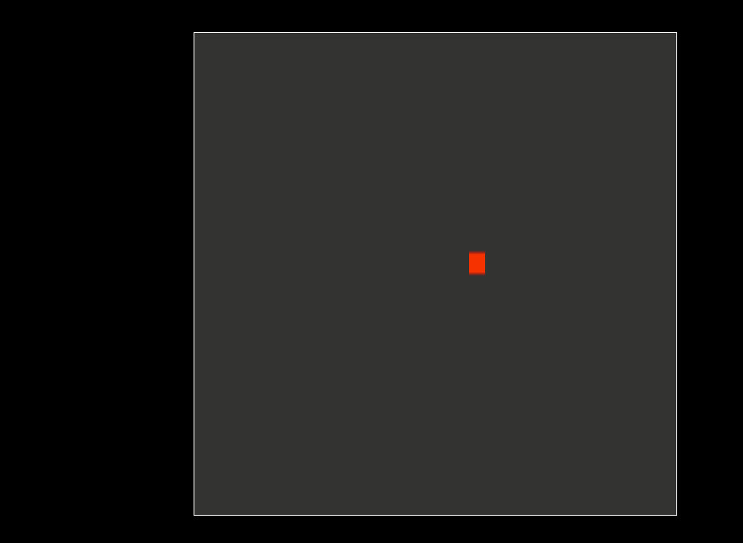

# Kontra Starter Template

This is a simple starter template for the [Kontra](https://straker.github.io/kontra) game engine.

"Kontra is a lightweight JavaScript gaming micro-library created specifically for the [Js13kGames](https://js13kgames.com) game jam."



## Installation

Requires node v14 so ensure that you run the following command:

```
nvm use
```

```bash
git clone https://github.com/kgish/kontra-starter-template.git
cd kontra-template
yarn
```

## Run

```bash
yarn dev
```

Point your favorite browser to `http://localhost:1234` and enjoy!

## Build

```bash
yarn build
```

## Lint

```bash
yarn lint
```

## Test

```bash
yarn test
```

## References

* [Kontra](https://straker.github.io/kontra)
* [Js13kGames](https://js13kgames.com)
* [Parcel](https://parceljs.org)
* [TypeScript](https://www.typescriptlang.org)
* [EsLint](https://eslint.org)
* [Stylelint](https://stylelint.io)
